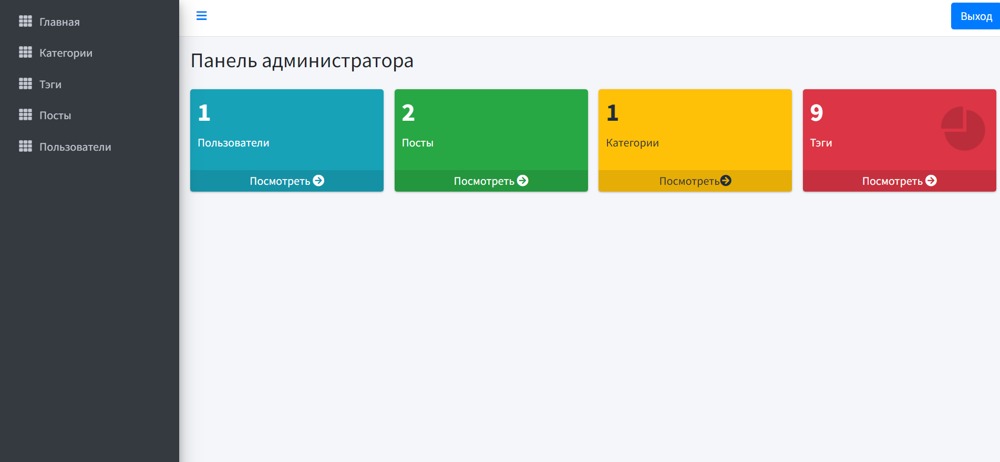

# 
 "Новостной блог"

## Немного о проекте
Сделан в качестве практики на Laravel.

## Используемые технологии

## Немного о проекте
В данном проекте реализована возможность создавать, удалять и изменять при необходимости посты, также категории и тэги.У постов может быть несколько тэгов и всего одна категория.А также добавлять и удалять новых пользователей, и задавать им роли администратора или читателя.Делать все это может лиш администратор сайта со специальной панели. 

На сайте реализовано несколько разделов с различной информацией(контакты, немного о компании).

ПОльзователь может выбрать нужную ему статью и прочитать весь ее текст.

## Как открыть/запустить
Воспользуйтесь установленным web-сервером OpenServer.Запускается с команды php artisan serve.